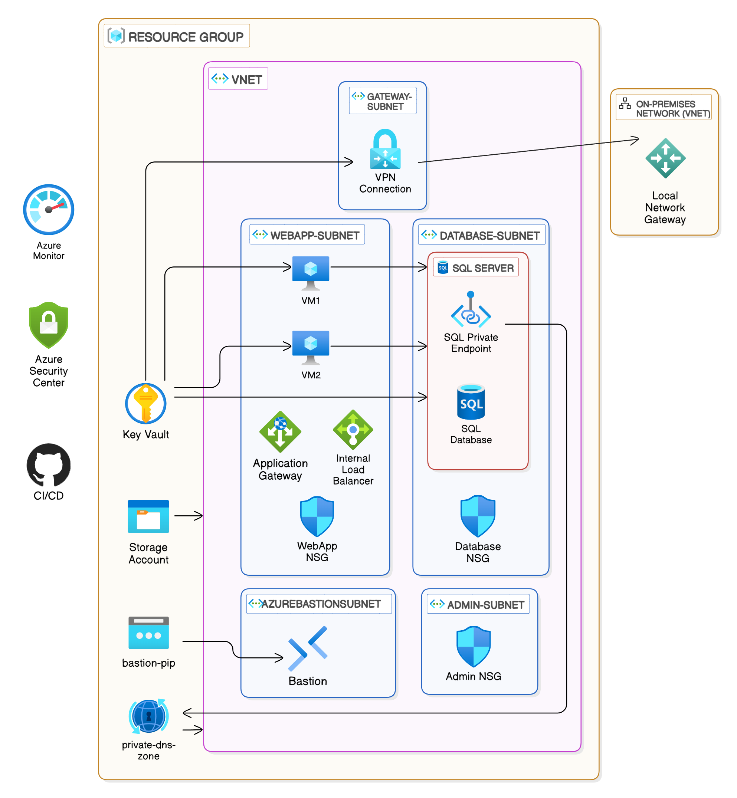

# AzureFusion
A project to design a hybrid networking environment using Azure's networking capabilities. This project set up a robust and scalable Azure infrastructure using Terraform, providing a foundation for secure and efficient network management.

### Project Overview

I designed a hybrid networking environment where on-premises networks connected securely to Azure resources using Azure's networking capabilities, ensuring secure data transition and effective resource access controls. This project involved setting up a comprehensive Azure infrastructure using Terraform. The key components included creating virtual networks, subnets, public IPs, VPN gateways, local network gateways, and establishing VPN connections. Additionally, I configured Private DNS Zones, Azure Bastion for secure administrative access, Azure Key Vault for secure storage of secrets and certificates, Application Gateway for secure web traffic management, Azure Monitor for resource monitoring and alerting, Azure Security Center (Defender) for continuous security assessment and recommendations, and Azure Storage Account for data storage.



### Technologies Used

**Terraform**
- **Azure Resource Manager (ARM)**
- **Azure Virtual Network**
- **Azure VPN Gateway**
- **Network Security Groups (NSGs)**
- **Azure Bastion**
- **Azure Private Link**
- **Azure DNS**
- **Azure Load Balancer**
- **Azure SQL Database**
- **Azure Storage Account**
- **Azure Key Vault**
- **Azure Monitor**
- **Azure Security Center (Defender)**

### Steps Taken

#### Azure Virtual Network Setup

- **Provisioned an Azure Virtual Network (VNet)**: Created a VNet in the chosen region with multiple subnets (e.g., WebApp Subnet, Database Subnet, Admin Subnet, Gateway Subnet, Bastion Subnet) to segregate resources effectively.

#### On-Premises Network Simulation

- **Simulated On-Premises Environment**: Used another VNet to simulate the on-premises environment.

#### Secure Connectivity

- **Implemented Azure VPN Gateway**: Created a site-to-site VPN connection between the simulated on-premises VNet and the main Azure VNet. Verified the connection to ensure seamless communication between VNets, simulating a hybrid environment.

#### Resource Deployment

- **Deployed Test Resources**: Deployed virtual machines (VMs) in the WebApp Subnet of the main Azure VNet. Examples included two web server VMs in the WebApp Subnet and a database in the Database Subnet.

#### Network Access Control

- **Configured Network Security Groups (NSGs)**: Defined inbound and outbound access rules for each subnet to allow only valid traffic, such as HTTP/HTTPS traffic to the WebApp Subnet.

#### Secure Administrative Access

- **Implemented Azure Bastion**: Enabled secure RDP and SSH access to VMs without exposing them to the public internet using Azure Bastion.

#### Private Access to Azure PaaS Services

- **Used Azure Private Link**: Configured private endpoints within the VNet to access Azure PaaS services (e.g., Azure SQL Database) securely, ensuring data did not traverse the public internet.

#### DNS and Load Balancing

- **Configured Azure DNS**: Set up custom domain names for resources using Azure DNS.
- **Implemented Azure Load Balancer**: Configured an internal load balancer to distribute traffic across VMs in the WebApp Subnet.

#### Azure Key Vault Integration

- **Stored Secrets and Certificates in Azure Key Vault**: Stored sensitive information such as admin usernames, passwords, and SSL certificates in Azure Key Vault.
- **Configured Access to Key Vault**: Ensured that the service principal has the necessary permissions to access secrets and certificates in the Key Vault.

#### Application Gateway Configuration

- **Configured Application Gateway**: Set up the Application Gateway to manage external traffic to the web app VMs. Configured the gateway to use the SSL certificate stored in Azure Key Vault for secure HTTPS traffic. Enabled Web Application Firewall (WAF) for enhanced security and configured SSL offloading to improve performance.

#### Monitoring and Security

- **Set Up Azure Monitor**: Configured Azure Monitor to collect metrics and set up alerts for resource monitoring.
- **Activated Azure Security Center (Defender)**: Enabled the free tier of Azure Security Center (Defender) to enhance security with continuous assessment and basic security features.

#### Diagnostic Settings

- **Configured Diagnostic Settings**: Set up diagnostic settings to send logs and metrics to Azure Monitor and Log Analytics.

#### Alert Rules

- **Configured Alert Rules**: Set up alert rules to notify when certain conditions are met, such as high CPU usage.

#### Storage Account Configuration

- **Provisioned Azure Storage Account**: Set up an Azure Storage Account for data storage, ensuring secure and scalable storage solutions.

#### Enabled MFA

- **Enabled Multi-Factor Authentication (MFA)**: Configured Azure AD Conditional Access policies to require MFA for all administrative access. The steps taken to achieve this included:
  - **Used Azure CLI to Create a Conditional Access Policy**:
    - **Defined the Policy Name and Description**: Set the policy name to "Require MFA for Admins" and provided a description.
    - **Defined the List of Administrative Roles**: Included roles such as Global Administrator, User Administrator, and Privileged Role Administrator.
    - **Created the Conditional Access Policy**: Used Azure CLI commands to create the policy and require MFA for the specified roles.

  ```sh
  # Define the policy name and description
  policyName="Require MFA for Admins"
  policyDescription="Require MFA for all administrative roles"

  # Define the list of administrative roles
  adminRoles=$(az ad sp list --filter "displayName eq 'Global Administrator' or displayName eq 'User Administrator' or displayName eq 'Privileged Role Administrator'" --query "[].objectId" -o tsv)

  # Create the Conditional Access policy
  az ad conditionalaccess policy create --display-name "$policyName" \
    --state "enabled" \
    --conditions "{ \"users\": { \"includeRoles\": [\"$adminRoles\"] }, \"applications\": { \"includeAllApplications\": true } }" \
    --grant-controls "{ \"operator\": \"AND\", \"builtInControls\": [\"mfa\"] }" \
    --session-controls "{}"

### Security and Compliance

#### Alignment with NIST SP 800-53

This project aligns with several key controls from the NIST SP 800-53 framework, including:

- **Access Control (AC)**: Implemented Network Security Groups (NSGs) and Azure Bastion for secure access.
- **Audit and Accountability (AU)**: Configured Azure Monitor and Log Analytics for centralized logging and monitoring.
- **Configuration Management (CM)**: Used Terraform for consistent and repeatable infrastructure configurations.
- **Identification and Authentication (IA)**: Utilized Azure Key Vault for secure storage of sensitive information.
- **System and Communications Protection (SC)**: Established secure site-to-site VPN connections and private endpoints.
- **System and Information Integrity (SI)**: Enabled Azure Security Center (Defender) for continuous security assessment and recommendations.

#### Zero Trust Architecture

The project also adheres to Zero Trust Architecture principles:

- **Verify Explicitly**: Ensured secure access to VMs using Azure Bastion and defined explicit NSG rules.
- **Use Least Privilege Access**: Restricted access to necessary traffic only and controlled access to sensitive information using Azure Key Vault.
- **Assume Breach**: Configured continuous monitoring and alerting with Azure Monitor and Security Center (Defender), and used secure communication channels like VPN Gateway and Private Link.

#### Performance and Security Testing

- **Simulated Network Scenarios**: Tested performance by simulating various network scenarios, such as data transition between on-premises and Azure.
- **Validated Security Configurations**: Attempted to access resources from unauthorized paths to ensure security configurations were effective.

### Areas to Improve Security Posture

- **Implement Regular Audits**: Conduct regular audits and reviews of security configurations.
- **Develop Incident Response Plan**: Create and test an incident response plan.
- **Ensure Device Security**: Verify that all devices meet security standards.
- **Implement User Behavior Analytics**: Detect and respond to anomalous activities.
- **Implement ZTNA**: Provide secure remote access to applications and resources.